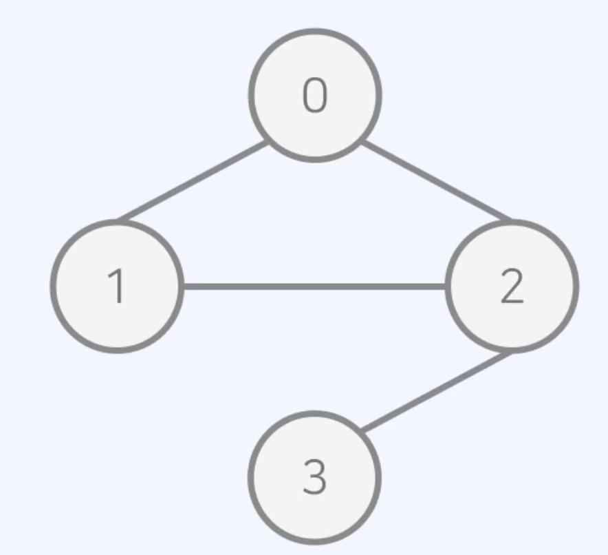
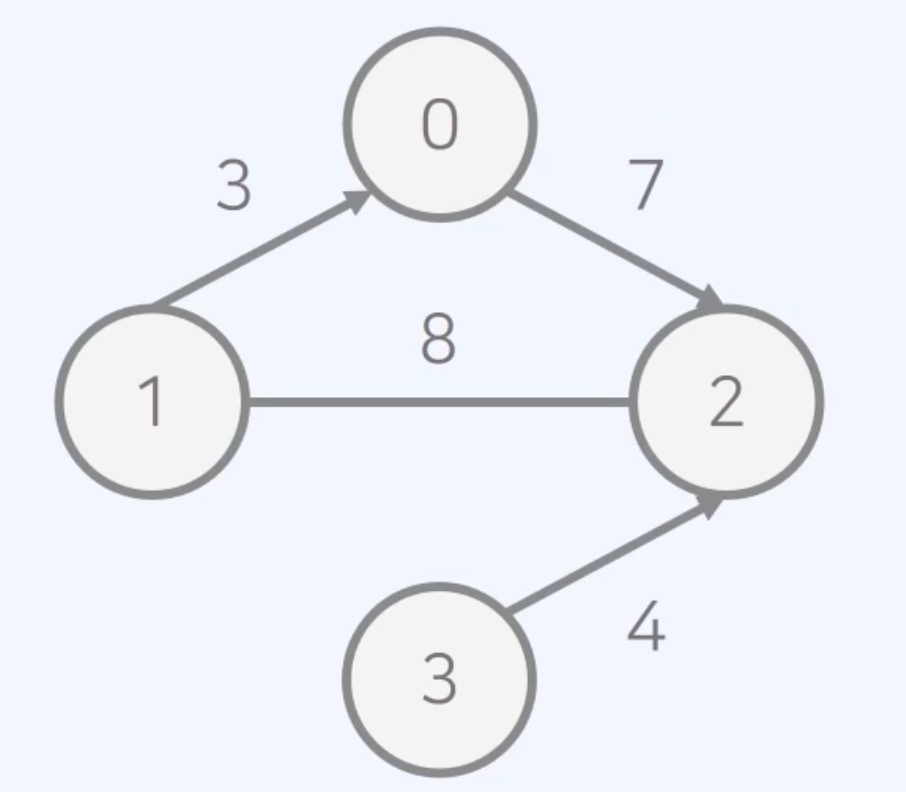

## 그래프

- 사물을 정점(노드)와 간선으로 나타내기 위한 도구
- 구현 방법
  - 인접 행렬 : 2차원 배열을 사용하는 방식
  - 인접 리스트 : 연결 리스트를 이용하는 방식

### 인접 행렬

- 무방향 무가중치 그래프
  - 무방향 그래프 : 모든 간선이 방향성을 가지지 않는 그래프
  - 무가중치 그래프 : 모든 간선에 가중치가 없는 그래프
  - 해당 그래프가 주어지면 연결되어 있는 상황을 `인접 행렬`로 출력 가능
    
    ```
    let graph = [
        [0,1,1,0],
        [1,0,1,0],
        [1,1,0,1],
        [0,0,1,0]
    ]
    ```
- 방향 가중치 그래프

  - 위와 정반대

    

    ```
    let graph = [
        [0,0,7,0],
        [3,0,8,0],
        [0,8,0,0],
        [0,0,4,0]
    ]
    ```

### 인접 리스트

- 그래프를 리스트로 표현한다.
  ```
  0: [(1,3),(2,7)]
  1: [(0,3)]
  2: [(0,7)]
  ```
- 무방향 무가중치 리스트

    

  ```
  let graph = [
      [1,2],
      [0,2],
      [0,1,3],
      [2]
  ]
  ```

- 방향 가중치 리스트
  

  ```
  let graph = [
      [(2,7)],
      [(0,3),(2,8)],
      [(1,8)],
      [(2,4)]
  ]
  ```

### 그래프의 시간 복잡도

- 인접 행렬
  - 모든 정점들의 연결 여부를 저장해 O(V<sup>2</sup>)의 공간을 요구한다.
  - 공간 효율성이 떨어지지만, 두 노드의 연결 여부를 O(1)에 확인 가능
- 인접 리스트
  - 연결된 간선의 정보만을 저장하여 O(V+E)의 공간을 요구한다.
  - 공간 효율성이 우수하지만, 두 노드의 연결 여부를 확인하기 위해 O(V)의 시간이 필요하다.
