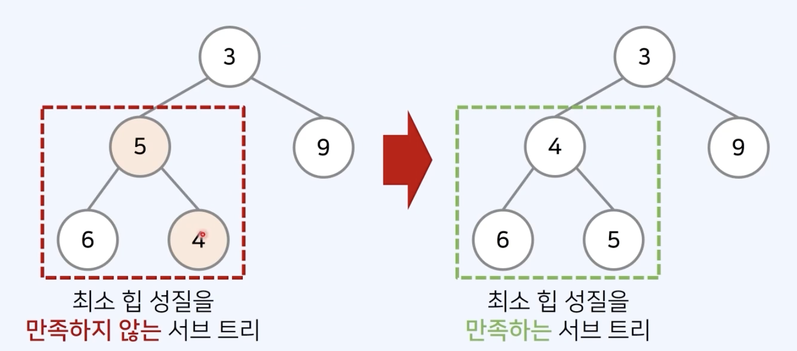

## 트리

- 가계도와 같이 `계층적인 구조를 표현`할 때 사용할 수 있는 자료구조이다.
- 나무를 뒤집은 것과 같이 생겼다.

### 용어

- 루트 노드(root node) : 부모가 없는 최상위 노드
- 단말 노드(leaf node) : 자식이 없는 노드
- 깊이 : 루트 노드에서의 길이
- 높이 : 루트 노드에서 가장 깊은 노드까지의 길이를 의미
- 길이란, 출발 노드에서 목적지 노드까지 거쳐야하는 `간선의 수`를 의미
- 이진 트리(Binary Tree) : 최대 2개의 자식을 가질 수 있는 트리
   
   
  

## 우선 순위 큐(Priority Queue)

- 우선 순위에 따라서 데이털르 추출하는 자료구조
- 컴퓨터 운영체제, 온라인 게임 매층 등에서 활용
- 우선 순위 큐는 일반적으로 `힙을 이용해 구현`한다.

  | 자료구조     | 추출 되는 데이터             |
  | ------------ | ---------------------------- |
  | 스택         | 가장 나중에 삽입된 데이터    |
  | 큐           | 가장 먼저 삽입된 데이터      |
  | 우선 순위 큐 | 가장 우선 순위가 높은 데이터 |

### 구현 방법

- 데이터의 개수가 N개일 때, 구현 방식에 따른 시간 복잡도
  | 구현 방식 | 삽입 시간 | 삭제 시간 |
  |---------|---------|------|
  | 리스트 자료형 | O(1) | O(N) |
  | 힙 | O(log N) | O(log N) |

## 힙

- 원소들 중에서 최댓값 혹은 최솟값을 빠르게 찾아내는 자료구조
- 최대 힙 : 값이 큰 원소부터 추출
- 최소 힙 : 값이 작은 원소부터 추출
- 힙은 원소의 삽입과 삭제를 위해 O(log N)의 수행 시간을 요구
- 단순한 N개의 데이터를 힙에 넣었다가 모두 꺼내는 작업은 정렬과 동일
- 해당 경우 시간 복잡도는 O(Nlog N)이다.

### 최대 힙

- 부모 노드가 자식 노드보다 값이 큰 `완전 이진 트리`를 의미.

### 힙의 특징

- 힙은 `완전 이진트리 자료구조`를 따른다.
- 우선 순위가 높은 노드가 루트에 위치
- 최대 힙
  - 부모 노드의 키 값이 자식 노드의 키 값보다 항상 크다.
  - 루트 노드가 가장 크며, 값이 큰 데이터가 우선 순위를 가진다.
- 최소 힙
  - 부모 노드의 키 값이 자식 노드의 키 값보다 항상 작다.
  - 루트 노드가 가장 작으며, 값이 작은 데이터가 우선 순위를 가진다.

### 최소 힙 구성 함수 : Heapify

- 부모로 거슬러 올라가며, 부모보다 자신이 더 작은 경우에 위치를 교체한다.
- 새로운 원소가 삽입 되었을 때, 부모로 거슬로 올라가며, 부모가 자신보다 클때 위치를 교체
- 삭제 될 때, 루트 노드를 꺼내주고 가장 마지막 원소를 루트 노드로 바꾼다. 그 뒤에 하향식으로 루트 노드를 바꿔주는 방식으로 진행된다.
- 시간 복잡도 O(log N)
  
