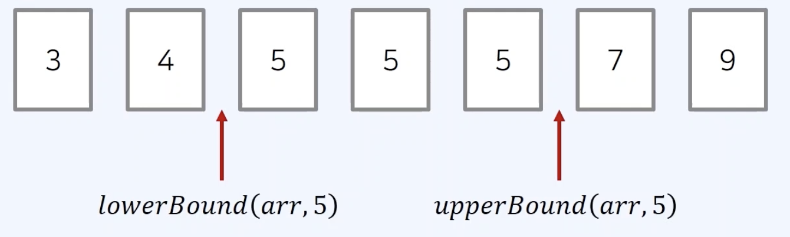
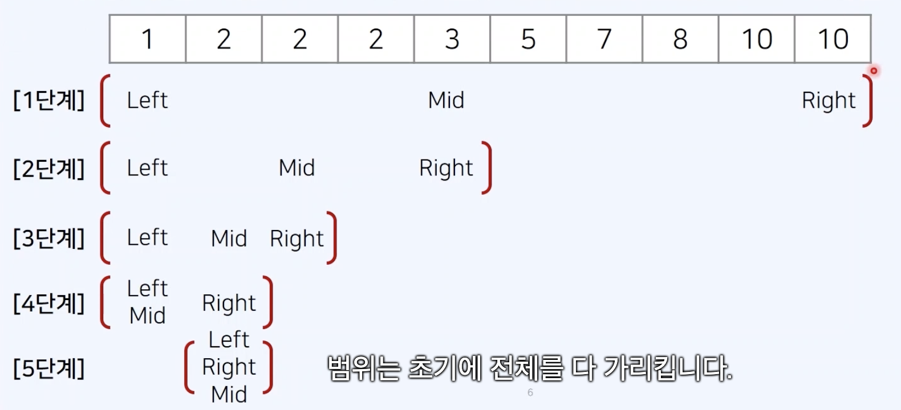

## 이진 탐색

- 순차 탐색 vs 이진 탐색
  - 리스트에서 값이 12인 원소의 위치를 찾고자 할 때, 찾는 방법?
    1. 리스트안에 특정한 데이터를 찾기 위해 앞에서부터 하나씩 확인 O(N)
    2. `정렬 되어 있는 리스트`에서 탐색 범위를 절반씩 좁혀가며 데이터 탐색 O(log N)

### 동작 방식

- 이진 탐색을 수행할 때는 `시작점과 끝점`을 기준으로 탐색 범위를 명시한다.

### 문제 유형 대표 사례

- 매우 넓은(억 단위 이상) 탐색 범위에서 최적의 해를 찾아야 하는 경우
- 데이터를 정렬한 뒤에 `다수의 쿼리`를 날려야 하는 경우

### 코드 예시 (재귀 함수)

```
const binarySearch = (arr, target, start, end) => {
    if (start > end) return -1;
    let mid = parseInt((start + end)/2);
    if(arr[mid] > target) return mid;
    else if(arr[mid] < target) return binarySearch(arr, target, start, mid - 1);
    else return binarySearch(arr, target, mid + 1, end);
}

let n = 10;
let target = 7;
const arr = [1, 3, 5, 7, 9, 11, 13, 15, 17, 19];

let result = binarySearch(arr, target, 0, n-1);
if(result == -1) console.log("원소가 존재하지 않습니다.");
else console.log(`${result + 1}번째 원소입니다.);
```

### 코드 예시 (반복문)

```
const binarySearch = (arr, target, start, end) => {
    while(start <= end){
      let mid = parseInt((start + end)/2);
      if(arr[mid] == target) return mid;
      else if(arr[mid] > target) end = mid - 1;
      else start = mid + 1;
    }
    return -1;
}

let n = 10;
let target = 7;
const arr = [1, 3, 5, 7, 9, 11, 13, 15, 17, 19];

let result = binarySearch(arr, target, 0, n-1);
if(result == -1) console.log("원소가 존재하지 않습니다.");
else console.log(`${result + 1}번째 원소입니다.);
```

### 정렬된 배열에서 특정 원소의 개수 구하기

- 값이 특정 범위에 속하는 원소의 개수 구하기
  - 코테에서 `정렬된 배열`에서 값이 특정 범위에 해당하는 원소의 개수를 계산하는 것을 요구하는 경우 존재
  - 해당 문제를 해결하기 위해 `lowerBound() 또는 upperBound()`를 사용할 수 있다.

### LowerBound(하한), UpperBound(상한)



- lowerBound(arr,x) : 정렬된 순서를 유지하면서 배열 arr에 x를 넣을 가장 왼쪽 인덱스를 반환
  ```
  const lowerBound = (arr, target, start, end) => {
    while(start < end){
      let mid = parseInt((start + end) / 2);
      if(arr[mid] >= target) end = mid;
      else start = mid + 1;
    }
    return end;
  }
  ```
  
- upperBound(arr,x) : 정렬된 순서를 유지하면서 배열 arr에 x를 넣을 가장 오른쪽 인덱스를 반환
  ```
  const upperBound = (arr, target, start, end) => {
    while(start < end){
      let mid = parseInt((start + end) / 2);
      if(arr[mid] > target) end = mid;
      else start = mid + 1;
    }
    return end;
  }
  ```
